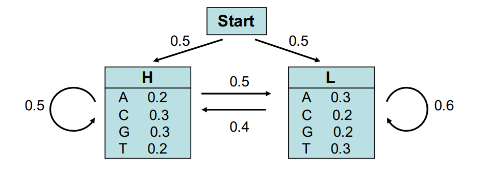

# Ejemplo Algoritmo Viterbi
Ejemplo de un algoritmo Viterbi aplicado a modelo oculto de Márkov sobre secuencia de ADN

## Introducción.

En los diferentes campos existen fenómenos estocásticos cuyas variables de estudio presentan una evolución temporal, de tal forma, que el valor futuro de las variables de estudio depende únicamente de su valor presente, siendo independiente del histórico de la variable. Cuando el proceso de estudio presenta esta característica, se dice que cumple con la propiedad de Márkov y por tanto se pueden modelar en procesos de Márkov.

Un proceso de Márkov es una serie de experimentos en el que cada uno tiene m posibles resultados (E1, E2.....Em), y la probabilidad de cada resultado depende exclusivamente del que se haya obtenido en los experimentos previos, o lo que es lo mismo, el valor futuro depende de su valor presente.
Adicionalmente, cuando los parámetros no se conocen, se dice que el problema está expresado en un modelo oculto de Márkov (HMM por sus siglas en ingles)

Mediante un simple ejemplo, se pretende resolver un problema de secuenciación de ADN expresado en un HMM usando un algoritmo de Viterbi programado en lenguaje Python.

## Problema propuesto.

Considere un problema de bioinformática de 2 estados: Alto y Bajo. El estado alto caracteriza ADN codificado (Alto contenido de Guanina y Citosina) y el estado bajo caracteriza ADN no codificado (Bajo contenido de Guanina y citosina).
El problema tiene las siguientes probabilidades:
- Inicio.
    - Estado alto: 0.5
    - Estado bajo: 0.5
- Transición: 
    - Alto a bajo: 0.5
    - Alto a alto: 0.5
    - Bajo a alto: 0.4
    - Bajo a bajo: 0.6
- Emisión estado alto:
    - Adenina: 0.2
    - Citosina: 0.3
    - Guanina: 0.3
    - Timina: 0.2
- Emisión estado bajo:
    - Adenina: 0.3
    - Citosina: 0.2
    - Guanina: 0.2
    - Timina: 0.3

Conociendo las probabilidades de inicio, transición y emisión, es posible modelar en un HMM, tal como se muestra a continuación:

El modelo puede ser usado para predecir la región de ADN codificado dada una secuencia:
- **GGCACTGAA**

## Metodología y algoritmo

Para resolver este problema de estado oculto de Márkov se aprovechará el algoritmo de Viterbi.
El algoritmo de Viterbi es un algoritmo de programación dinámica que permite calcular la ruta de estados mas probable en un modelo de estado oculto HMM, es decir, obtiene la secuencia óptima que mejor explica la secuencia de observaciones. (Para mas información ver https://en.wikipedia.org/wiki/Viterbi_algorithm)

## El algoritmo

El algoritmo fue desarrollado en Python sin uso de librerías o módulos extra. [DNA_viterbi.py]
En la cabecera del código, se programaron 2 ejemplos de secuencia como tupla de caracteres, siendo la secuencia 1 la requerida en el problema (GGCACTGAA).
Posteriormente se programan las probabilidades del problema. Estados como lista de caracteres, y probabilidades como diccionarios anidados.
Finalmente, el código contiene dos funciones:
- viterbi: Algoritmo de interés que procesa el HMM.
- dptable: Función auxiliar para la impresión de resultados por consola.

## Resultados

Al ejecutar el algoritmo anterior se obtienen los siguientes resultados:

|    |G  |G  |C  |A  |C  |T  |G  |A  |A  |
|:-: |:-:|:-:|:-:|:-:|:-:|:-:|:-:|:-:|:-:|
|Alto (H) | 0.15000| 0.02250| 0.00337| 0.00033| 0.00006| 0.00000| 0.00000| 0.00000| 0.00000|
|Bajo (L) | 0.10000| 0.01500| 0.00225| 0.00050| 0.00006| 0.00001| 0.00000| 0.00000| 0.00000|

De estos resultados se obtiene que la ruta mas probable de estado es:

    H -> H -> H -> L -> L -> L -> L -> L -> L

con una mayor probabilidad de 4.25e-08

## Referencias
- Guido, M. (s. f.). El proceso de Márkov. El proceso de Márkov. Recuperado 10 de enero de 2022, de http://www.dinamica-de-sistemas.com/revista/0605h.htm
- Wikipedia contributors. (2021a, enero 10). Markov property. Wikipedia. Recuperado 10 de enero de 2022, de https://en.wikipedia.org/wiki/Markov_property
- Wikipedia contributors. (2021b, diciembre 10). Hidden Markov model. Wikipedia. Recuperado 10 de enero de 2022, de https://en.wikipedia.org/wiki/Hidden_Markov_model
- Durbin et al (1998)
- Borodovsky & Ekisheva (2006), pp 80-81